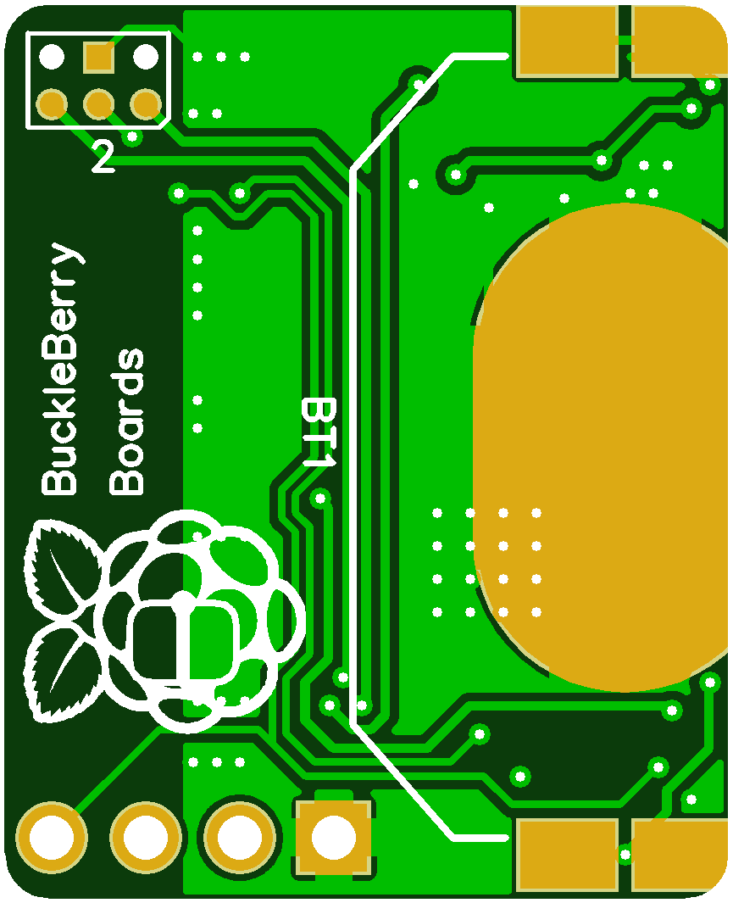

#  BuckleBerry Boards

|ID|Name|Designator|Footprint|Quantity|Manufacturer Part|Manufacturer|Supplier|Supplier Part|LCSC Assembly|
|---|---|----------|---------|--------|-----------------|------------|--------|-------------|-------------|
|1|4.7uF|C10|0603'|1|CL10A475KO8NNNC|SAMSUNG|LCSC|C19666|Yes|
|2|12pF|C1,C2|0402'|2|0402CG120J500NT|FH|LCSC|C1547|Yes|
|3|4.7nH|L1|0402'|1|SDCL1005C4N7STDF|Sunlord|LCSC|C13595|Yes|
|4|Header-Male-2.54_1x4|H1|DIP-1X4P-2.54MM-M|1|210S-1*4P L=11.6MMGold-plated black|Ckmtw|LCSC|C124378||
|5|10K|R1,R2|0402'|2|0402WGF1002TCE|UniOhm|LCSC|C25744|Yes|
|6|3.3nH|L3|0402'|1|LQG15HS3N3S02D|MuRata|LCSC|C86064|Yes|
|7|ANTENNA_QUARTER-WAVE_MONOPOLE_MEANDERED_RIGHT+0|1|QWMP_MEANDERED_RIGHT_+0|1||||||
|8|16MHz|X1|SMD-3225_4P|1|NX3225GA-16MHZ(STD-CRG-2)|Nihon Dempa Kogyo|LCSC|C156247|Yes|
|9|10nH|L2|0402'|1|SDCL1005C10NJTDF|Sunlord|LCSC|C27147|Yes|
|10|1.5pF|C6|0402'|1|0402CG1R5C500NT|FH|LCSC|C1552|Yes|
|11|15nH|L5|0402'|1|SDCL1005C15NJTDF|Sunlord|LCSC|C27143|Yes|
|12|1K|R7|0402'|1|0402WGF1001TCE|UniOhm|LCSC|C11702|Yes|
|13|160K|R3|0603'|1|0603WAF1603T5E|UniOhm|LCSC|C22813|Yes|
|14|10uH|L4|0603'|1|SDFL1608S100KTF|Sunlord|LCSC|C1035|Yes|
|15|PROGRAMMING_PORT_REALIGN_0.05|2|PROGRAMMING_PORT_REALIGN_05|1||||||
|16|1nF|C8|0402'|1|0402B102K500NT|FH|LCSC|C1523|Yes|
|17|1uF|C12|0603'|1|CL10A105KB8NNNC|SAMSUNG|LCSC|C15849|Yes|
|18|KT-0603R|LED1|LED-0603|1|KT-0603R|KENTO|LCSC|C2286|Yes|
|19|nRF51822-QFAA-R|U1|QFN-48_6X6X04P|1|nRF51822-QFAA-R|NORDIC|LCSC|C38167|Yes|
|20|TPL5110DDCT|U3|TSOT-23-6|1|TPL5110DDCT|Texas Instruments|LCSC|C125830|Yes|
|21|10uF|C13|0402'|1|CL05A106MQ5NUNC|SAMSUNG|LCSC|C15525|Yes|
|22|1uF|C14|0402'|1|CL05A105KA5NQNC|SAMSUNG|LCSC|C52923|Yes|
|23|1pF|C4|0402'|1|0402CG1R0C500NT|FH|LCSC|C1550|Yes|
|24|100nF|C11,C7|0402'|2|CL05B104KO5NNNC|SAMSUNG|LCSC|C1525|Yes|
|25|BATTERY-20MM_SMD_4LEGS_UNDERPASTE|BT1|BATTCON_20MM_4LEGS_UNDERPASTE|1||||||
|26|2.2pF|C5|0402'|1|0402CG2R2C500NT|FH|LCSC|C1559|Yes|
|27|SHT20|U4|DFN-6-EP|1|SHT20|Sensirion|LCSC|C53865|Yes|
|28|47nF|C9|0402'|1|CL05B473K05NNNC|SAMSUNG|LCSC|C26403|Yes|
|29|510K|R6|0402'|1|0402WGF5103TCE|UniOhm|LCSC|C11616|Yes|
|30|DMG3415U-7|Q1|SOT-23(SOT-23-3)-A|1|DMG3415U-7|Diodes Incorporated|LCSC|C96616|Yes|
|31|2.2nF|C3|0402'|1|0402B222K500NT|FH|LCSC|C1531|Yes|
